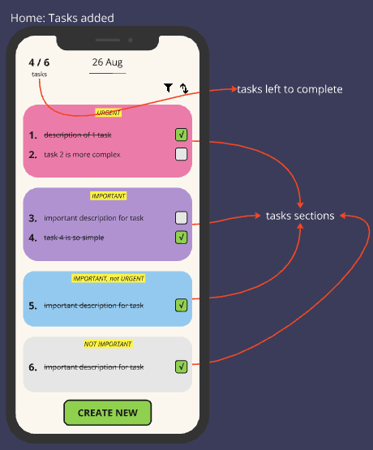

# UrgentDaily

## *ToDo list organizer using tasks and calendar*

### Description

> MVP
- Create tasks
    - Give a title;
    - Set it as recursive depending on days of the week;
    - Organize tasks by priority
        - Urgent - Important - Import, not urgent - Not Important
    - Save tasks on Database

---

### Development

- **Design and wireframes**
    - Miro
- **Project planning and organization**
  - Notion
- **Prototype**
    - FlutterFlow
- **App**
    - Flutter
- **Backend**
    - ~~Pocketbase~~
    - Firebase

---
### Screenshots

HomePage prototype:
--

Current UI:
--

